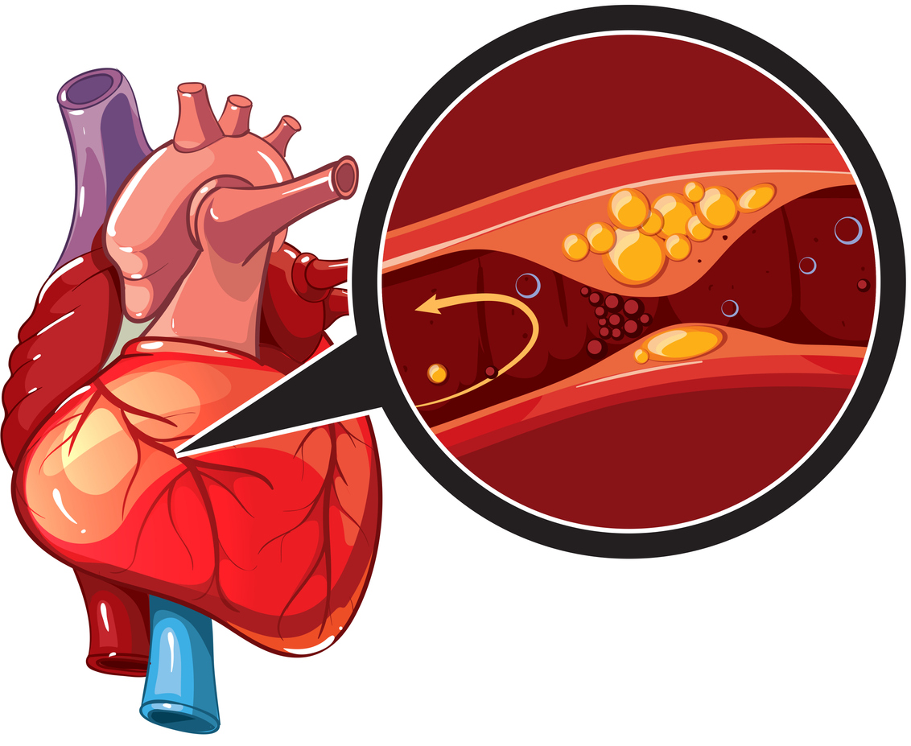

```{r setup, include=FALSE}
options(htmltools.dir.version = FALSE)
```

```{r , echo = FALSE, message = FALSE, warning = FALSE}
library(tidyverse)
library(datasets)
library(kableExtra)
library(dplyr)
library(magrittr)
library(ggplot2)
```


class: center, middle
# ETC5513 Group 4
.content-box-soft[ 
 Min Min Soh  
 Yan Chui Lucia Cheung  
 Sanna Meer  
 Aphiaut Imuan

]
---

# Introduction - Causes of Death

## Areas discussed: 

- HIV/AIDS
- Malaria
- Nutritional deficiencies
- Cardiovascular diseases
---

## Research Questions: 

- How have death from the chosen area changed over time in the world? 
- What are the top 5 countries with the highest death rates from the chosen area and the death trends from those countries? 
- What are the preventative measures for the chosen area? 

```{r read_csv, echo = FALSE, message = FALSE, warning = FALSE}
Deaths <- read_csv("Data/annual-number-of-deaths-by-cause.csv")
```

---

# Deaths - HIV/AIDS

- .blue[How have death from **HIV / AIDS** changed over time in the world ? ]
- .blue[What are the top 5 countries with the highest death rates from **HIV / AIDS** and the death trends for those countries? ]
- .blue[What are the preventive measures for **HIV / AIDS** ? ]


---

.content-box-soft[ 
Deaths rates from HIV/AIDS in the world
]

```{r HIV_AIDS,  echo = FALSE, message = FALSE, warning = FALSE }
HIV_AIDS <- Deaths %>% 
  select( Entity, Code, Year, `Deaths - HIV/AIDS - Sex: Both - Age: All Ages (Number)`) %>%
  rename(Deaths_HIV_AIDS = `Deaths - HIV/AIDS - Sex: Both - Age: All Ages (Number)` )%>%
  filter(!is.na(Deaths_HIV_AIDS))
                
                 
```


```{r World_trend, echo = FALSE, message = FALSE, warning = FALSE , dpi=300, out.width = '70%'}
HIV_AIDS %>% filter (Entity == "World")%>%
  mutate(round_Deaths_HIV_AIDS = Deaths_HIV_AIDS/1000)%>%
  ggplot(aes(x= Year, 
             y = round_Deaths_HIV_AIDS))+
  geom_line(linetype = "dashed", color = "blue", size =1 ) +
  geom_point(color = "blue", size = 3)+
  labs(y = "Number of Deaths from HIV/AIDS per 100,000 people",
       x = "Year")+
  ggtitle("Deaths rates from HIV/AIDS")+
  theme_minimal()
```


---
class: left, top

.content-box-soft[ 
Top 5 countries with the highest average death rates from HIV / AIDS
]


```{r average_HIV,   echo = FALSE, message = FALSE, warning = FALSE}
#disable scientific notation
options(scipen=999)
#calculate average death rates per nation
HIV_AIDS_nation <- HIV_AIDS %>% 
  filter(!Entity %in% c("Asia", "Africa", "African Region", "Central Asia", "Central Europe", "Central Europe, Eastern Europe, and Central Asia",
                        "Central Latin America", "Central sub-Saharan Africa", "Commonwealth High Income", "Commonwealth Low Income", 
                        "Commonwealth Middle Income" , "East Asia","East Asia & Pacific - World Bank region", "Eastern Europe", 
                        "Eastern Mediterranean Region", "Eastern sub-Saharan Africa" ,"Europe & Central Asia - World Bank region", 
                        "European Region", "European Union" , "G20", "Low SDI", "High SDI", "Low-middle SDI",  "High-income", 
                        "High-income Asia Pacific", "High-income North America" , "High-middle SDI","Latin America & Caribbean - World Bank region" ,
                        "Middle SDI","Commonwealth", "African Union", "Southern sub-Saharan Africa", "Region of the Americas",
                        "South-East Asia Region" , "Southeast Asia","Southeast Asia, East Asia, and Oceania", "South Asia - World Bank region",
                        "Sub-Saharan Africa - World Bank region" , "Western Europe", "Western Pacific Region" , "Western sub-Saharan Africa", 
                        "World" , "World Bank High Income", "World Bank Low Income","World Bank Lower Middle Income" ,
                        "World Bank Upper Middle Income"))
mean_HIV_AIDS <- HIV_AIDS_nation %>% 
  group_by(Entity)  %>% 
  summarise(`Average Death Rates from HIV/AIDS` =  mean(Deaths_HIV_AIDS, na.rm = TRUE)) %>%
  arrange(-`Average Death Rates from HIV/AIDS`)

mean_HIV_AIDS <- mean_HIV_AIDS %>% 
  mutate_if(is.numeric, round, digits=0)

mean_HIV_AIDS <- head(mean_HIV_AIDS,5)

knitr::kable(mean_HIV_AIDS,
             col.names = gsub("[.]", " ",
                              names(mean_HIV_AIDS)))
```

---
class: left, top

.content-box-soft[ 
Death trend in those top 5 countries with the highest average death rates from HIV / AIDS
]


```{r HIV_AIDS_nations, echo = FALSE, message = FALSE, warning = FALSE, dpi=300, out.width = '70%'}
HIV_AIDS %>% filter (Entity %in% c("South Africa", "Kenya","Tanzania", "India" , "Nigeria" ))%>%
  mutate(round_Deaths_HIV_AIDS = Deaths_HIV_AIDS/1000)%>%
  ggplot(aes(x= Year, 
             y = round_Deaths_HIV_AIDS,
             colour = Entity))+
  geom_line(linetype = "dashed", size =1 ) +
  geom_point(size = 2)+
  labs(y = "Number of Deaths from HIV/AIDS per 100,000 people",
       x = "Year")+
  ggtitle("Deaths rates from HIV/AIDS")+
  theme_minimal()
```


---
class: left, top
.content-box-soft[ 
Preventative Measures- Antiretroviral Therapy (ART) introduced in the 1980s
]


```{r ART, echo = FALSE, message = FALSE, warning = FALSE, dpi=300, out.width = '70%'}
ART <- read_csv("Data/hivaids-deaths-and-averted-due-to-art.csv")

ART  %>% filter (Entity %in% c( "Nigeria", "South Africa", "Kenya","Tanzania", "India"  ))%>%
  mutate(Deaths_averted = `Deaths averted due to ART - estimate`/1000)  %>%
   ggplot(aes(x= Year, 
             y = Deaths_averted, 
             colour = Entity))+
  geom_line(linetype = "dashed", size =1 ) +
  geom_point( size = 2)+
  labs(y = "Number of HIV/AIDS deaths averted per 100,000 people",
       x = "Year")+
  ggtitle("Number of HIV/AIDS deaths averted due to ART")+
  theme_minimal()
```

---
class: left, top
.content-box-soft[ 
Other measures on HIV prevention
]

- .blue[Contraception measures]

- .blue[Education on HIV/AIDS]

---
class: left, top

# Death - Malaria 

- .blue[How have death from **Malaria** changed over time in the world ? ]
- .blue[What are the top 5 countries with the highest death rates from **Malaria** and the death trends for those countries? ]
- .blue[What are the preventive measures for **Malaria** ? ]

---
class: left, top

# Malaria world trend 

```{r, echo = FALSE, preserve = TRUE}

malaria_data <- read.csv("Data/annual-number-of-deaths-by-cause.csv")

```

.pullleft1[
```{r, echo = FALSE, preserve = TRUE, dpi=300, out.width = '70%'}

malaria_data <- malaria_data %>%
  select(Entity, Year, Deaths...Malaria...Sex..Both...Age..All.Ages..Number.) %>%
  rename(Malaria = Deaths...Malaria...Sex..Both...Age..All.Ages..Number.) %>%
  rename(Country = Entity) %>%
  filter(Year >= 2000) 

malaria_world<- malaria_data %>%
  filter(Country == "World") 

ggplot(malaria_world, aes( x = Year, y = Malaria)) +
  geom_line()+
  scale_y_continuous(labels = scales::comma) + ggtitle("Malaria world trend")


```
]


---
class: left, top

# Top 5 Countries with **highest** Malaria death rate 


.center2[
```{r, echo = FALSE, preserve = TRUE}

malaria_mean <- malaria_data %>%
  group_by(Country) %>%
  summarize(Mean = mean(Malaria)) %>%
  mutate(Mean = ceiling(Mean)) %>%
  arrange(-Mean) %>%
   filter(!Country %in% c("Asia", "Africa", "African Region", "Central Asia", "Central Europe", "Central Europe, Eastern Europe, and Central Asia",
                        "Central Latin America", "Central sub-Saharan Africa", "Commonwealth High Income", "Commonwealth Low Income", 
                        "Commonwealth Middle Income" , "East Asia","East Asia & Pacific - World Bank region", "Eastern Europe", 
                        "Eastern Mediterranean Region", "Eastern sub-Saharan Africa" ,"Europe & Central Asia - World Bank region", 
                        "European Region", "European Union" , "G20", "Low SDI", "High SDI", "Low-middle SDI",  "High-income", 
                        "High-income Asia Pacific", "High-income North America" , "High-middle SDI","Latin America & Caribbean - World Bank region" ,
                        "Middle SDI","Commonwealth", "African Union", "Southern sub-Saharan Africa", "Region of the Americas",
                        "South-East Asia Region" , "Southeast Asia","Southeast Asia, East Asia, and Oceania", "South Asia - World Bank region",
                        "Sub-Saharan Africa - World Bank region" , "Western Europe", "Western Pacific Region" , "Western sub-Saharan Africa", 
                        "World" , "World Bank High Income", "World Bank Low Income","World Bank Lower Middle Income" ,
                        "World Bank Upper Middle Income"))

knitr::kable(head(malaria_mean, 5))

#knitr::kable(caption = "Top 5 Countries with highest Malaria death rate")


```
]

---
class: left, top

.content-box-soft[ 
Trending of the top 5 Countries
]
 

.pullleft1[
```{r, echo = FALSE, preserve = TRUE, fig.pos= "H", dpi=300, out.width = '70%'}

malaria_top5 <- malaria_data %>%
  filter(Country %in% c("Nigeria", "India", "Uganda", "Burkina Faso", "Democratic Republic of Congo")) 

ggplot(malaria_top5, aes( x = Year, y = Malaria, color = Country)) +
  geom_line()+
  scale_y_continuous(labels = scales::comma) + 
  ggtitle("Top 5 countries with the highest malaria death rate")


```
]


---
class: left, top

# Reasons for high death rate of malaria in these countries

-hot and humid weather

.content-box-soft[ 
* Temperature higher or equal to 21℃ is the most suitable condition for one of the fatal malaria parasite to grow into vector. 
]


-lack of comprehensive report system

.content-box-soft[ 
* In India, hospital and clinic do not report malaria cases to corresponding government organisation
]


---
class: left, top

# Preventive measures for Malaria

-Maldives: must report confirmed malaria cases to government

-Sri Lanka: set up mobile malaria clinics to detect cases 

-RTS.S subunit vaccine (still in testing stage)

-use of insecticide

-insecticide-treated net


---

class: left, top

# Death - Nutritional Deficiencies 

- .blue[How have death from **Nutritional Deficiencies** changed over time in the world ? ]
- .blue[What are the top 5 countries with the highest death rates from **Nutritional Deficiencies** and the death trends for those countries? ]
- .blue[What are the preventive measures for **Nutritional Deficiencies** ? ]

---


```{r, echo=FALSE, message=FALSE}
#reading the data
data <- read_csv(here::here("Data/test1.csv"))
data1 <- data %>%
  rename(Nutritional_deficiency_deaths = "Deaths - Nutritional deficiencies - Sex: Both - Age: All Ages (Number)",
         Country = "Entity")

#removing unwanted observations
 data2<- data1 %>% 
   select(Country,Year, Nutritional_deficiency_deaths) %>%
  filter(!Country %in% c("Asia", "Africa", "African Region", "Central Asia", "South-East Asia Region (WHO)", "East Asia & Pacific (WB)", "Region of the Americas (WHO)", "South Asia (WB)",	"African Region (WHO)", "Latin America & Caribbean (WB)", "Eastern Mediterranean Region (WHO)", "Western Pacific Region (WHO)", "OECD Countries", "Sub-Saharan Africa (WB)" ,"Central Europe", "Central Europe, Eastern Europe, and Central Asia",
                        "Central Latin America", "Central sub-Saharan Africa", "Commonwealth High Income", "Commonwealth Low Income", 
                        "Commonwealth Middle Income" , "East Asia","East Asia & Pacific - World Bank region", "Eastern Europe", 
                        "Eastern Mediterranean Region", "Eastern sub-Saharan Africa" ,"Europe & Central Asia - World Bank region", 
                        "European Region", "European Union" , "G20", "Low SDI", "High SDI", "Low-middle SDI",  "High-income", 
                        "High-income Asia Pacific", "High-income North America" , "High-middle SDI","Latin America & Caribbean - World Bank region" ,
                        "Middle SDI","Commonwealth", "African Union", "Southern sub-Saharan Africa", "Region of the Americas",
                        "South-East Asia Region" , "Southeast Asia","Southeast Asia, East Asia, and Oceania", "South Asia - World Bank region",
                        "Sub-Saharan Africa - World Bank region" , "Western Europe", "Western Pacific Region" , "Western sub-Saharan Africa", 
                        "World" , "World Bank High Income", "World Bank Low Income","World Bank Lower Middle Income" ,
                        "World Bank Upper Middle Income"))
 
```


```{r, echo = FALSE, message = FALSE, warning = FALSE}

 Nutr_def_data <- data2 %>%
  select(Country, Year, Nutritional_deficiency_deaths) %>%
  group_by(Country, Year) %>%
  summarise(Total_deaths = sum(Nutritional_deficiency_deaths, na.rm= TRUE))
```

# Worldwide trend


```{r, echo = FALSE, message = FALSE, dpi=300, out.width = '70%'}
data1 %>% filter (Country == "World")%>%
  ggplot(aes(x= Year, 
             y = Nutritional_deficiency_deaths))+
   geom_line(color = "blue") +
  ylab("Total_deaths") + xlab("Year") + ggtitle("The trend of Nutritional Deficiency deaths worldwide from 1990") + scale_y_continuous(labels = scales::comma)


```

---

#Top 5 countries with highest average  death rates


```{r top5, echo = FALSE, message = FALSE}
#top  countries with highest average  death rates

Highest_countries1 <- data2 %>%
         group_by(Country) %>%
          summarise(mean = mean(Nutritional_deficiency_deaths, na.rm = TRUE)) %>%
  arrange(-mean)

```


```{r top5countries, echo = FALSE, message = FALSE}
Highest_countries <- Highest_countries1 %>% 
  mutate_if(is.numeric, round, digits=0)

knitr::kable(head(
Highest_countries,5), booktabs = TRUE)

```


---

class: center, middle

```{r, echo=FALSE}
deaths_top5 <- data1 %>%
  filter(Country %in% c( "India", "Ethiopia", "Bangladesh", "North Korea", "Indonesia"))
```


# Top 5 countries


```{r, echo = FALSE, dpi=300, out.width = '70%'}
plot <-  deaths_top5 %>%
  group_by(Country) %>%
  ggplot() +
  geom_line(aes(x = Year, y = Nutritional_deficiency_deaths, color = Country)) +
  ylab("Number of death") + xlab("Year") + ggtitle("Top 5 countries with highest death rates due to Nutritional Deficiencies")

plot
```


---
class: center, middle

# Reasons and Preventive Measures
---

## .red[.bold[Reasons]]

* Several contributory factors such as .red[.bold[Poverty, lack of purchasing power, household food insecurity, and limited general knowledge]] about appropriate nutritional practices increase the risk of undernutrition in developing countries. 
* .red[.bold[The synergistic interaction between inadequate dietary intake and disease burden]] leads to a vicious cycle that accounts for much of the high morbidity and mortality in these countries.
* Three groups of underlying factors contribute to inadequate dietary intake and infectious disease: .red[.bold[inadequate maternal and child care, household food insecurity, and poor health services]] in an unhealthy environment.

---

## .green[.bold[Preventive Measures]]


Primary prevention measures taken to ensure more appropriate nutrient intakes in the population often include :
* .green[.bold[Education programs]] to encourage healthier and more nutritious food choices
* .green[.bold[Food-based approaches]] that increase the availability or affordability of nutrient-rich foods; and,
* .green[.bold[National policies]] to fortify commonly-eaten foods


---

class: center, middle

.content-box-duke-green[ 
**Death of Cardiovascular diseases**
]

.pull-left[
```{r out.width = '80%', echo = FALSE}
knitr::include_graphics("figs/UDMI_Cardiovascular-Disease.png")
```

]


.pull-right[
```{r out.width = '80%', echo = FALSE}

```

]

---

class: center, top
.content-box-duke-green[ 
 **Death - Cardiovascular diseases** 
]

- How are the trend of **Cardiovascular diseases** change across the years in the WORLD ? 

- What are the 5 countries with highest death of Cardiovascular diseases ?

- What are the healthy lifestyle factors measures for Cardiovascular diseases ? 

---

class: center, middle
.content-box-soft[ 
**Number of Deaths - Cardiovascular diseases (World)**
]

```{r, echo=FALSE, message=FALSE}
test <- read_csv("Data/test1.csv") 
cardio <- test %>%
  rename("cardio_num" = "Deaths - Cardiovascular diseases - Sex: Both - Age: All Ages (Number)") %>%
  rename("country" = Entity)%>%
  select(country,Year, cardio_num) %>%
  filter(!country %in% c("G20", "World Bank Upper Middle Income",
                         "East Asia & Pacific (WB)", "World Bank Lower Middle Income",
                         "Western Pacific Region (WHO)", "European Region (WHO)",
                         "Europe & Central Asia (WB)", "South-East Asia Region (WHO)",
                         "OECD Countries", "World Bank High Income", "South Asia (WB)",
                         "Region of the Americas (WHO)", "Eastern Mediterranean Region (WHO)",
                         "Latin America & Caribbean (WB)", "African Region (WHO)",
                         "Sub-Saharan Africa (WB)", "North America (WB)",
                         "Middle East & North Africa (WB)", "World Bank Low Incom", "World Bank Low Income"))

```

```{r, echo=FALSE, out.width = '70%', dpi=300}
cardio_world <- cardio %>%
  filter(country == "World")

graph_world <-  cardio_world %>%
  group_by(country)%>%
  ggplot() +
  geom_line(aes(x = Year, y = cardio_num, color = country)) +
  ylab("Number of death") + xlab("Year") + ggtitle("Cardiovascular diseases world trend")+ scale_y_continuous(labels = scales::comma)

graph_world
```

---

class: center, middle
.content-box-soft[ 
**Number of Deaths - Cardiovascular diseases (TOP 5)**
]

```{r, echo=FALSE, out.width = '70%', dpi=300}
cardio_top5 <- cardio %>%
  filter(country %in% c( "China", "India", "Russia", "United States", "Indonesia"))


graph <-  cardio_top5 %>%
  group_by(country)%>%
  ggplot() +
  geom_line(aes(x = Year, y = cardio_num, color = country)) +
  ylab("Number of death") + xlab("Year") + ggtitle("The 5 highest countries by death of Cardiovascular diseases") +scale_y_continuous(labels = scales::comma)


graph
```

---
class: center, top

# Healthy lifestyle factors


.pull-left[
.red[Smoking]
 
 .tiny[<span>Photo by <a href="https://unsplash.com/photos/KThe9Aw7IFkt">Haim Charbit</a> on <a href="https://unsplash.com/photos/KThe9Aw7IFk">Unsplash</a></span>]

]
.pull-left[
```{r out.width = '50%', echo = FALSE}

```

]

.pull-left[
.green[Excercise] 

.tiny[<span>Photo by <a href="https://unsplash.com/photos/a6FHROHuQ9o">Alex McCarthy</a> on <a href="https://unsplash.com/photos/a6FHROHuQ9o">Unsplash</a></span>]

]
.pull-left[
```{r out.width = '50%', echo = FALSE}
knitr::include_graphics("figs/alex-mccarthy-a6FHROHuQ9o-unsplash.jpg")
```

]

.pull-left[
.green[Healthy Foods]
 
 .tiny[<span>Photo by <a href="https://unsplash.com/photos/4_jhDO54BYg">Dan Gold</a> on <a href="https://unsplash.com/photos/4_jhDO54BYg">Unsplash</a></span>]
]
.pull-left[
```{r out.width = '50%', echo = FALSE}
knitr::include_graphics("figs/dan-gold-4_jhDO54BYg-unsplash.jpg")
```

]

---
class: center, middle

```{r , echo = FALSE}

``` 

